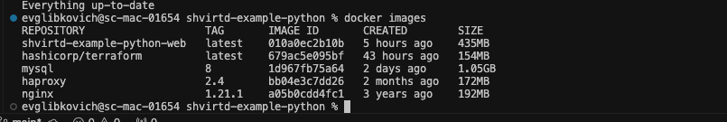
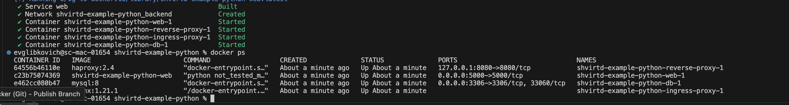
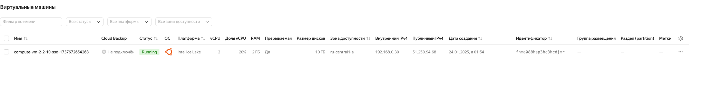
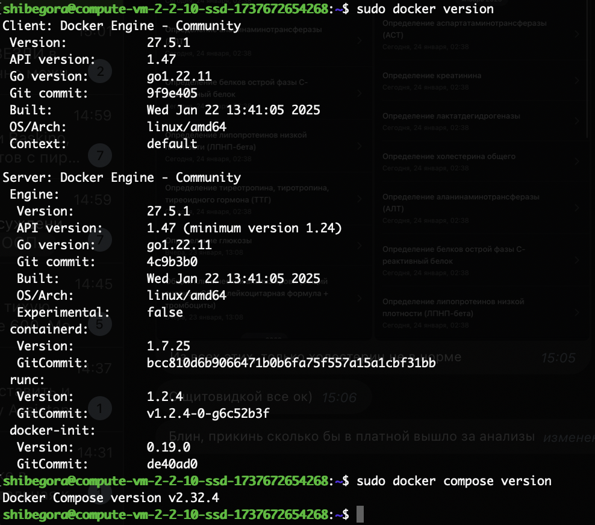

Задание 1

Пункт 2




Задание 3

 
 



Задание 4

Пункт 1
ВМ создана


Пункт 2


Пункт 3

```
#! /bin/bash

REPO_PATH=/opt/shvirtd-example-python

# get repo
git clone https://github.com/shibegora/shvirtd-example-python.git $REPO_PATH

# run project
cd $REPO_PATH
docker compose up -d
cd
```
Пункт 4


Пункт 6 


Задание 6

 
